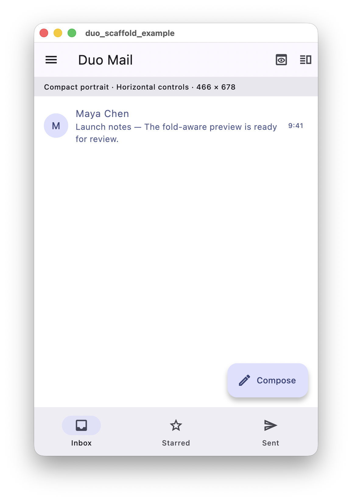
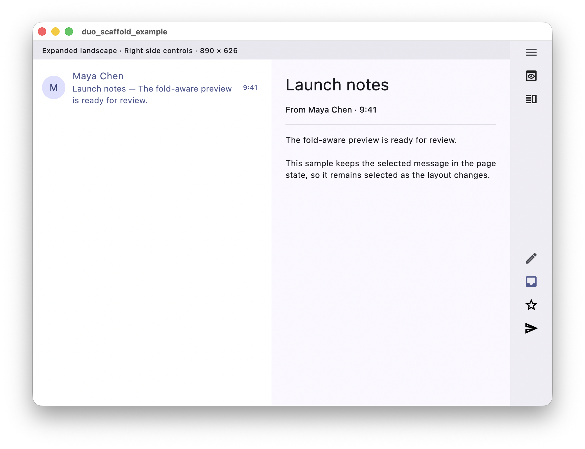

# duo_scaffold

[](https://flutter.dev)
[](https://david723798.github.io/duo_scaffold/)

`duo_scaffold` provides a complete adaptive `DuoScaffold` page and fold-aware Flutter layout primitives. It chooses a layout from the space available to the widget and Flutter's `DisplayFeature` data, while your application keeps ownership of navigation and content state.

## Live demo

Try the interactive Mail example on GitHub Pages: [Demo](https://david723798.github.io/duo_scaffold/)

## Screenshots

| Compact portrait | Expanded landscape |
| --- | --- |
| On compact screens, the Mail example presents one pane at a time with familiar top-and-bottom controls. | On wider displays, it keeps both the message list and selected message visible, and moves controls to a physical side rail. |
|  |  |

## Install

```sh
flutter pub add duo_scaffold
```

The package supports Dart `>=3.4.0 <4.0.0` and Flutter `>=3.22.0`.
It is tested against the minimum supported Flutter release, representative
stable releases, and the latest stable channel.

## Quick start

Use one `DuoScaffold` as the page and put `DuoBody` in its body. Keep the selected pane in page state and provide the two pieces of content.

```dart
import 'package:duo_scaffold/duo_scaffold.dart';
import 'package:flutter/material.dart';

void main() => runApp(const MaterialApp(home: MailPage()));

class MailPage extends StatefulWidget {
  const MailPage({super.key});

  @override
  State<MailPage> createState() => _MailPageState();
}

class _MailPageState extends State<MailPage> {
  bool _showingInbox = true;

  @override
  Widget build(BuildContext context) => DuoScaffold(
    appBar: AppBar(title: const Text('Mail')),
    body: DuoBody(
      compactPane: _showingInbox ? DuoPane.primary : DuoPane.secondary,
      primary: ListView(
        children: <Widget>[
          ListTile(
            title: const Text('A message'),
            onTap: () => setState(() => _showingInbox = false),
          ),
        ],
      ),
      secondary: Center(
        child: FilledButton(
          onPressed: () => setState(() => _showingInbox = true),
          child: const Text('Back to inbox'),
        ),
      ),
    ),
  );
}
```

On compact layouts, `compactPane` selects the visible pane. On expanded landscape or book layouts, both panes appear side by side. Inactive compact panes remain mounted, so their local widget state is retained, but they are offstage, cannot receive focus, and do not tick animations. The same pane elements are retained when switching presentation, including from compact to book or tabletop.

## Choose the right widget

| Need | Use |
| --- | --- |
| Adapt a primary and optional secondary pane in an existing page | `DuoBody` |
| Move declared actions and destinations between top-and-bottom controls and a physical side rail | `DuoScaffold` |
| Apply the same safe-area behaviour to a custom Scaffold slot | `DuoSafeArea` |

## Layout behaviour

| Available condition | Resolved layout | `DuoBody` presentation |
| --- | --- | --- |
| Width below 600 logical pixels | Compact portrait or landscape | One pane selected by `compactPane` |
| Width at least 600 and room for two 280 px panes | Expanded portrait or landscape | Two panes only in expanded landscape; expanded portrait uses the compact presentation |
| Half-open vertical fold or hinge | Book | Two horizontal panes around the feature |
| Half-open horizontal fold or hinge | Tabletop | `tabletopTop` and `tabletopBottom`, when either is supplied |

The defaults are `expandedBreakpoint: 600` and `minimumPaneExtent: 280`. Set them directly on `DuoBody` for normal use:

```dart
DuoBody(
  expandedBreakpoint: 720,
  minimumPaneExtent: 320,
  primary: const InboxList(),
  secondary: const MessageDetail(),
)
```

`DuoLayoutPolicy` remains available when an application shares a resolver across several bodies. Use `layoutOverride` directly on `DuoBody` to force a layout for a preview or test.

```dart
const mailLayoutPolicy = DuoLayoutPolicy(
  expandedBreakpoint: 720,
  minimumPaneExtent: 320,
);

// Pass `policy: mailLayoutPolicy` to each relevant DuoBody.
```

Book and tabletop are chosen only from a half-open Flutter `DisplayFeature`. The package does not infer a fold posture from aspect ratio. If tabletop content is omitted, `DuoBody` falls back to its compact presentation.

## Safe areas and display features

`DuoBody` protects foreground panes with `SafeArea` by default. Keep a visual background outside `DuoBody` when it should extend edge to edge, and wrap a custom app bar, bottom bar, or side control in `DuoSafeArea` when it needs the same protection. Set `safeArea: false` only if the parent already applies the required insets.

`DisplayFeature.bounds` uses view coordinates. If a `DuoBody` is nested below an offset container, pass `DuoDisplayFeature` values translated into the body's local coordinate space when hinge placement must be exact.

## Adaptive side controls

`DuoScaffold` uses the supplied app bar, bottom navigation, and floating action button below 600 logical pixels. At or above 600, it uses a physical right-side rail by default. Its `left` and `right` placements stay physical in right-to-left layouts.

Use it directly as the page. Keep the selected destination in page state, then declare the actions and destinations that the host can move to the rail:

```dart
class _MailPageState extends State<MailPage> {
  String _selectedDestination = 'inbox';

  @override
  Widget build(BuildContext context) => DuoScaffold(
    actions: <DuoAction>[
      DuoAction(
        id: 'search',
        label: 'Search',
        icon: const Icon(Icons.search),
        onPressed: _openSearch,
      ),
    ],
    footerActions: <DuoAction>[
      DuoAction(
        id: 'compose',
        label: 'Compose',
        icon: const Icon(Icons.edit_outlined),
        onPressed: _compose,
      ),
    ],
    destinations: const <DuoDestination>[
      DuoDestination(
        id: 'inbox',
        label: 'Inbox',
        icon: Icon(Icons.inbox_outlined),
        selectedIcon: Icon(Icons.inbox),
      ),
      DuoDestination(
        id: 'starred',
        label: 'Starred',
        icon: Icon(Icons.star_outline),
        selectedIcon: Icon(Icons.star),
      ),
    ],
    selectedDestinationId: _selectedDestination,
    onDestinationSelected: (id) => setState(() => _selectedDestination = id),
    appBar: AppBar(
      title: Text(_selectedDestination),
      actions: <Widget>[
        IconButton(icon: const Icon(Icons.search), onPressed: _openSearch),
      ],
    ),
    floatingActionButton: FloatingActionButton(
      onPressed: _compose,
      child: const Icon(Icons.edit_outlined),
    ),
    bottomNavigationBar: NavigationBar(
      selectedIndex: _selectedDestination == 'inbox' ? 0 : 1,
      onDestinationSelected: (index) => setState(
        () => _selectedDestination = index == 0 ? 'inbox' : 'starred',
      ),
      destinations: const <Widget>[
        NavigationDestination(icon: Icon(Icons.inbox_outlined), label: 'Inbox'),
        NavigationDestination(icon: Icon(Icons.star_outline), label: 'Starred'),
      ],
    ),
    bodyBuilder: (context, chrome) =>
        Center(child: Text('Showing $_selectedDestination')),
  );
}
```

`appBar`, `bottomNavigationBar`, and `floatingActionButton` appear in top-and-bottom mode. On a side rail, `actions` appear at the top, `footerActions` near the bottom, and `destinations` at the bottom. Supply both the horizontal widgets and the rail declarations for controls needed in both modes. A supplied `drawer` automatically gains a rail menu button and opens on the matching physical edge, including in right-to-left layouts. `leadingAction` overrides that button. Use `body` for ordinary content; use `bodyBuilder` only when it needs the resolved chrome layout and remaining content size. The optional `topAndBottomBuilder` wraps the built body inside the Material scaffold and must include it; use it for custom content arrangements.

For normal customization, set `chromeLayout` or `sideRailBreakpoint` directly on `DuoScaffold`:

```dart
DuoScaffold(
  chromeLayout: DuoChromeLayout.leftRail,
  body: const InboxPage(),
)
```

`DuoChromePolicy` remains available for sharing a policy across pages. The package itself does not detect native hardware control regions.

## `DuoScaffold` properties

| Property | Type | Description |
| --- | --- | --- |
| `key` | `Key?` | Widget key passed to the underlying `StatelessWidget`. |
| `body` | `Widget?` | Page content that does not need resolved chrome information. Provide either this or `bodyBuilder`. |
| `bodyBuilder` | `Widget Function(BuildContext, DuoChromeInfo)?` | Builds page content after the scaffold chrome is resolved. `DuoChromeInfo` provides the layout, rail width, and remaining content size. Provide either this or `body`. |
| `scaffoldKey` | `GlobalKey<ScaffoldState>?` | Key used to access the underlying Material `Scaffold`, for example to open a drawer. |
| `appBar` | `PreferredSizeWidget?` | App bar shown only in `topAndBottom` layout. |
| `drawer` | `Widget?` | Drawer for the page. In rail layouts it is assigned to the matching physical edge and gets a default rail menu button unless `leadingAction` is supplied. |
| `floatingActionButton` | `Widget?` | Floating action button shown only in `topAndBottom` layout. |
| `floatingActionButtonLocation` | `FloatingActionButtonLocation?` | Position for `floatingActionButton` when it is shown. |
| `bottomNavigationBar` | `Widget?` | Bottom navigation or other bottom bar shown only in `topAndBottom` layout. |
| `bottomSheet` | `Widget?` | Persistent bottom sheet passed to the underlying Material `Scaffold` in every layout. |
| `backgroundColor` | `Color?` | Background color passed to the underlying Material `Scaffold`. |
| `resizeToAvoidBottomInset` | `bool?` | Whether the scaffold resizes its body when the on-screen keyboard appears. |
| `policy` | `DuoChromePolicy` | Resolves top-and-bottom, left-rail, or right-rail chrome. Defaults to `const DuoChromePolicy()`. |
| `chromeLayout` | `DuoChromeLayout?` | Forces the control placement. Takes precedence over `policy.layoutOverride`. |
| `sideRailBreakpoint` | `double?` | Width at which controls move to a side rail. Takes precedence over `policy.sideRailBreakpoint`. |
| `platformLayout` | `DuoChromeLayout?` | Optional application-provided platform layout passed to `policy` during resolution. |
| `actions` | `List<DuoAction>` | Side-rail actions placed near the top. They are sorted by `visibilityPriority`; overflow actions move into a menu. Defaults to an empty list. |
| `leadingAction` | `DuoAction?` | First control in a side rail. Overrides the automatic drawer menu button. |
| `footerActions` | `List<DuoAction>` | Side-rail actions placed near the bottom, above destinations; suited to primary content actions. Defaults to an empty list. |
| `destinations` | `List<DuoDestination>` | Destinations rendered at the bottom of a side rail. Defaults to an empty list. |
| `selectedDestinationId` | `String?` | ID of the selected `DuoDestination`. |
| `onDestinationSelected` | `ValueChanged<String>?` | Called with a destination ID when a rail destination is selected. |
| `railWidth` | `double` | Width of the side rail, excluding any safe-area inset. Defaults to `72`; must be greater than zero. |
| `sideRailColor` | `Color?` | Background color of the side rail. Defaults to the theme's `surfaceContainer` color. |
| `maxVisibleActions` | `int` | Maximum number of top `actions` shown before an overflow menu is used. Defaults to `4`; must not be negative. |
| `topAndBottomBuilder` | `Widget Function(BuildContext, DuoChromeInfo, Widget)?` | Optionally wraps the built body in `topAndBottom` layout. The returned widget must include the supplied body. |

## Explore the Mail example

The included Mail app is the complete reference implementation. It keeps the selected mailbox, selected message, and compact-pane selection in `MailDemoPage`, then composes `DuoScaffold` and `DuoBody`.

```sh
cd example
flutter pub get
flutter run
```

To run the browser example explicitly, use `flutter run -d chrome`. See [example/README.md](example/README.md) for platform-specific commands.

It can preview all six layouts, simulated book and tabletop hinges, and top-and-bottom, left-rail, or right-rail controls. See [example/README.md](example/README.md) for a feature-to-API map.

## Development

Run the checks before opening a change:

```sh
dart format .
flutter analyze
flutter test
cd example && flutter test
```
